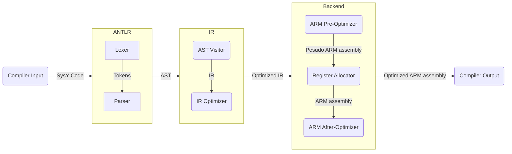

```mermaid
flowchart LR
    subgraph ANTLR
    Lexer
    Lexer --> |Tokens| Parser
    end
    subgraph IR
    av(AST Visitor)
    av(AST Visitor) --> |IR| io(IR Optimizer)
    end
    subgraph Backend
    apo(ARM Pre-Optimizer) --> |Pesudo ARM assembly| ra(Register Allocator)
    ra(Register Allocator) --> |ARM assembly| aao(ARM After-Optimizer)
    end
    ui(Compiler Input) --> |SysY Code| ANTLR
    ANTLR --> |AST| IR
    IR --> |Optimized IR| Backend
    Backend --> |Optimized ARM assembly| co(Compiler Output)  
```

